# ADLSys Coursework

## Lab 0: Introduction to Mase

### Tutorial 2

**Task:** Remove the `attention_mask` and `labels` arguments from the `hf_input_names` list and re-run the following cell. Use `mg.draw()` to visualize the graph in each case. Can you see any changes in the graph topology? Can you explain why this happens?

**Answer:** 

Without attention_mask: 

The mase graph has replaced attention_mask node with a identity mapping node, essentially removing the causal attention mask. This allow the model's query and key to attend to both past and future tokens in the sequence.

Without labels: 

The mase graph output layer outputs the features of dim 2 directly. When the labels input is added, the output computes the Cross-Entropy loss directly using the labels provided.

With labels | Without labels
:-------------------------:|:-------------------------:
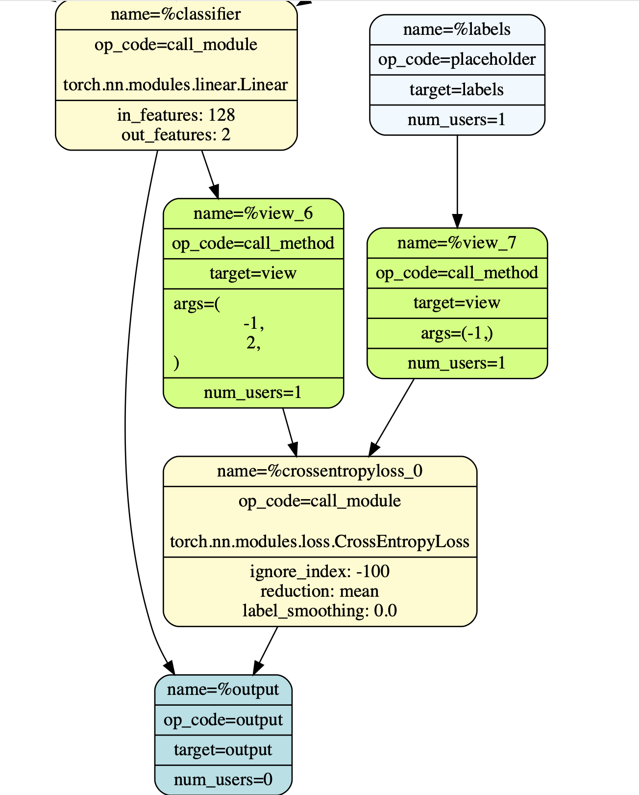 | 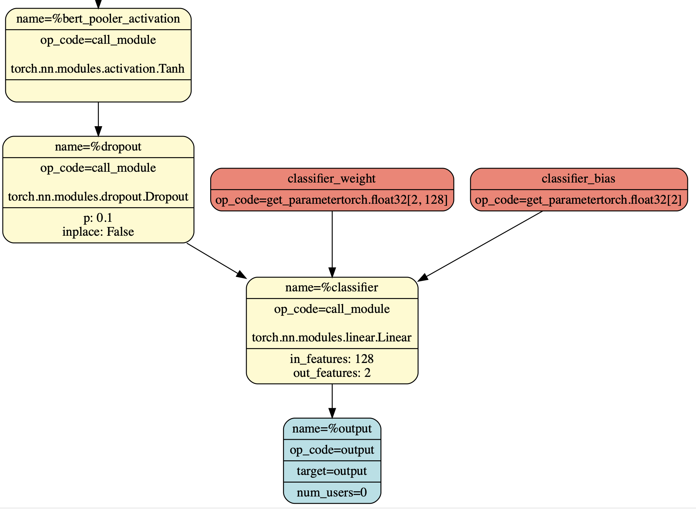

<!--  -->
<!-- 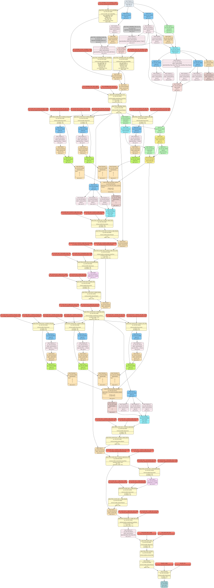 -->

--- 

## Lab 1: Model Compression (Quantization and Pruning)

### Tutorial 3

**Task:**  Plot a figure where the x-axis is the fixed point width and the y-axis is the highest achieved accuracy on the IMDb dataset, following the procedure in Tutorial 3. Plot separate curves for PTQ and QAT at each precision to show the effect of post-quantization finetuning.

**Answer:**
I have plotted the change in model performance with respect to quantization width, for both post training quantization and quantization aware training that finetunes for 3 epochs post quantization.

The overall error due to quantization can be split into a variance and a bias part, where the bias is the theoretical lower bound of error. 

It can be seen that model using QAT strategy consistently preserves accuracy better than PTQ. This is expected, as QAT perform finetuning after quantization, it should reduce the overall error induced by quantization as it is likely that a local minimum exists that is better than the model directly after quantized. However, when the quantization width is too low (INT4), QAT and PTQ has similar performances. This suggests that the error is now dominated by the bias, hence we see insignificant performance gap between the two strategies.
<!-- PTQ results: [0.5, 0.8162, 0.8364, 0.83552]
QAT results: [0.5, 0.8398, 0.8428, 0.84236] -->
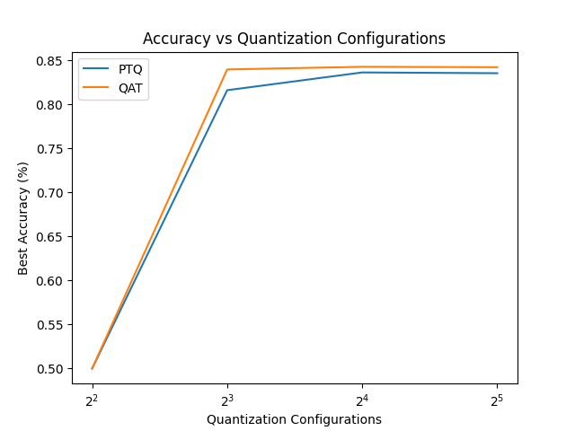

--- 

### Tutorial 4

**Task:** Take your best obtained model from Task 1 and rerun the pruning procedure, this time varying the sparsity from 0.1 to 0.9.

Plot a figure where the x-axis is the sparsity and the y-axis is the highest achieved accuracy on the IMDb dataset, following the procedure in Tutorial 4.

Plot separate curves for Random and L1-Norm methods to evaluate the effect of different pruning strategies.

**Answer:** 
It can be seen that pruning using L1-Norm strategy consistently outperform pruning with a pure random strategy in unstructured pruning, maintaining a reasonable accuracy up to a sparsity of 0.7. L1-Norm pruning is superior than random, because it removes less important parts of the model by measuring the L1-Norm of weights. Weights with small L1-norm are pruned, because they contribute less to the model’s output.

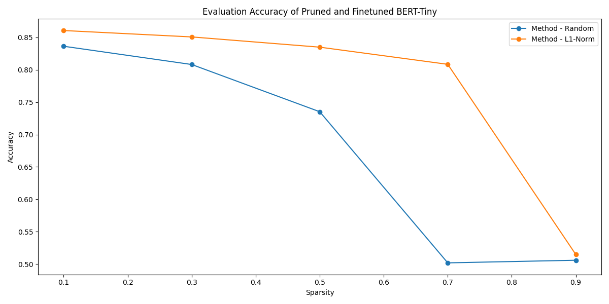

--- 

## Lab 2: Neural Architecture Search

### Tutorial 5

**Task 1:** Plot a figure that has the number of trials on the x axis, and the maximum achieved accuracy up to that point on the y axis. Plot one curve for each sampler to compare their performance.

**Answer:** 
I experimented NAS search using grid, random and TPE sampler. To prevent exploding grid search, I have limited the grid search space by fixing linear_layer_choices=Linear, which resulted in a 300 trials search. Grid sampling achieved the best performance in the shortest trials, followed by TPE search and lastly random. 

Grid sampling exhausted all combinations of architectural parameters, and has likely found a local optimum in the reduced search space. TPE sampler chooses a new sample trial based on historical good trials, making it to find optimal configurations faster than random sampler in the full search space. It is likely that increasing the trials further, TPE sampler will eventually beat the current grid_search optimum.
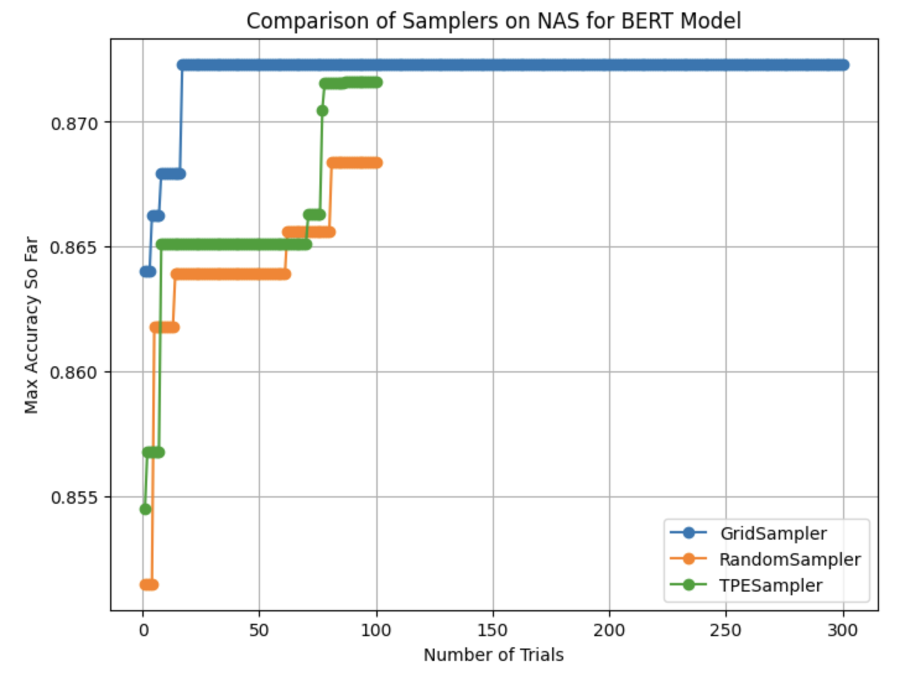

---

**Task 2:**  Plot a new figure that has the number of trials on the x axis, and the maximum achieved accuracy up to that point on the y axis. There should be three curves: 1. the best performance from Task 1 (without compression), compression-aware search without post-compression training, and compression-aware search with post-compression training.

**Answer:**  In this task I chose to use TPE instead of grid, despite being the second best performance in Task 1. This is because running a full grid_search is not practical if linear_layer_choices are required to be taken into consideration.

From the graph, it can be seen that compression-aware search strategy (with post-training) has the best accuracy, followed by the standard TPE sampler search and lastly compression-aware search without post-training. To explain the performance gap of the different strategies the compression strategy is important. The compression pipeline consists of both quantization and pruning. As a result of the induced error from model compression, compression model without post-training has worse performance than the standard TPE sampler search. It is less obvious to reason why with fine-tuning, compression-aware search seems to beat the standard search. A guess is that whilst pruning, the model's search space has reduced is actually not better at the long run.
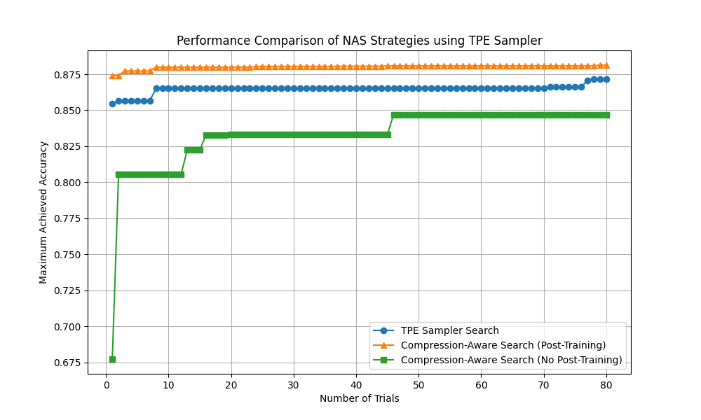

--- 

## Lab 3: Mixed Precision Search

### Tutorial 6

**Task:** Modify the code to allow different layers to have widths in the range [8, 16, 32] and fractional widths in the range [2, 4, 8]. Extend the search to consider all supported precisions (configurations?) for the Linear layer in Mase, including Minifloat, BlockFP, BlockLog, Binary, etc. Plot a figure that has the number of trials on the x axis, and the maximum achieved accuracy up to that point on the y axis. Plot one curve for each precision to compare their performance.

**Answer:** 
I performed mixed-precision quantization search on BERT-tiny over 80 epochs, where I have created an Optuna study for each number representation format supported by MASE. The search is quantization-aware, using 3 epochs for finetuning in each quantization trial.

It can be observed that LinearBinaryResidualSign has a significant performance degrade compared to the others. Other binary-type number representations also suffer from significant performance degrade in the beginning of the search, but manages to catch up with the others in later trials.

The rest of the number representations have a close performance, but zooming-in we can see that log-based representations achieve the best performance, with LinearBlockLog achieving the best performance. Log-based quantization assigns more precision to smaller values and less precision to larger values compared to linear quantization. Weights and bias are usually regularized, meaning they have a left-skewed distribution of magnitude. Therefore, log-based quantization better suits for quantizing weights and biases, and achieves better performance.

Overview | Zoomed-in view
:-------------------------:|:-------------------------:
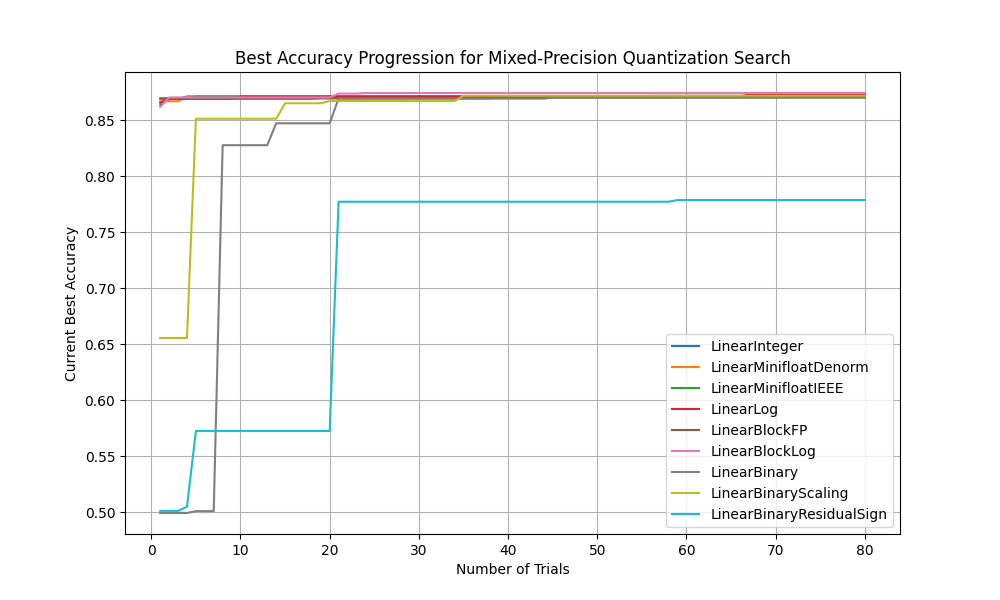 | 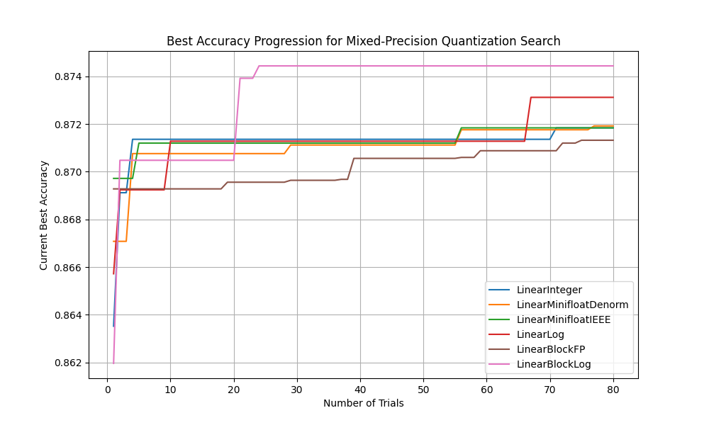

--- 

## Lab 4: Software Stream

**Task 1:** Optimizing with torch.compile()

**a)** In the first part of Lab 4 (torch.compile), we did not really observe real run-time speedups with torch.compile. Modify the code and investigate why this is the case?

**Answer:** 
When using torch.compile() for the first time, the runtime includes the JIT compilation time because it uses Dynamo which is a just-in-time compiler:
- torch dynamo frontend rewrites Python into an FX Graph via dynamic analysis of the original Python bytecode
- optimization is applied automatically by passes and transformations of FX Graph
- then, torch dynamo backend (inductor) takes the graph and to compile into Triton code
- Triton is then used to generate kernels on GPUs

JIT compilers have the characteristics that start slow but (usually) progressively gets faster, which is what we observe here.

---

**b)** If you change the device to cuda, do you observe the same thing?

**Answer:** 
Yes. Dynamo's JIT compilation will be done on the CPU still, which incurs a similar overhead until the optimized CUDA kernel is generated which is then cached and ran on GPU.

---

**Task 2:** Kernel fusion (SDPA)

**a)** Now, extend the profiling to the SDPA kernel, compare its runtime behavior with the naive implementation.

**Answer:** 
Fused kernel performs better than the naive implementation consistently, and the runtime remains constant in general.
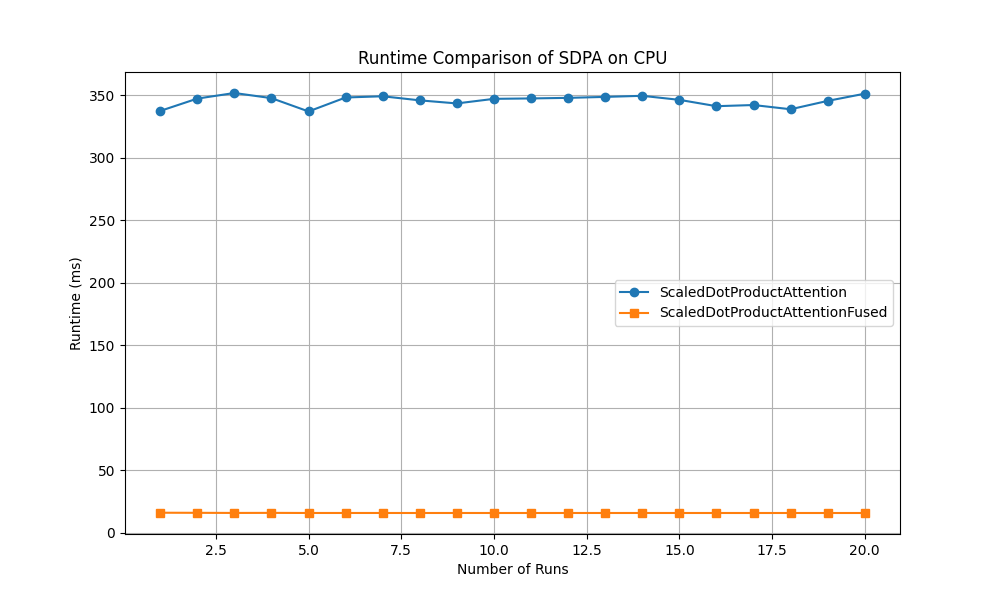

---

**b)** If you change the device to cuda, do you observe the same thing?

**Answer:** 
Fused kernel consistently performs better still. However, we can see that both naive and fused implementation now starts with high runtime that decreases to a stable runtime over a few runs.
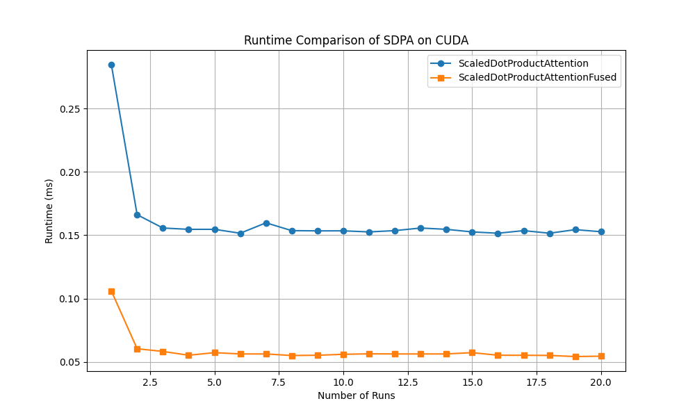

---

**Task 3:** Custom kernel

**a)** How does MXINT8 benefit custom hardware if both the activation and weights in a linear layer are quantized to MXINT8?

**Answer:** 
The effective bitwidth (per entry in group) is less, and the exponent width (8 for MXINT) is shared accross all entries making this effect more. With MXINT8, the effective bitwidth is (mantissa_width + exponent_width/group_size) = (8 + 8/group_size). 

The reduction of total bits by converting a FP32 vector to MXINT8 is 32\*vector_size - num_group\*group_size\*(8 + 8/group_size). (e.g. MXINT8 vector of dimension 10, if group_size=10 it requires 88 bits in total, whereas FP32 requires 320 bits)

For linear layer, there are usually a lot of parameters (many to many connections). Since the weights and bias are likely regularised by the loss function which penalies large weights, they are likely to reside in a range that can be captured using a shared exponent, so MXINT8 quantization on the weights isn't prone to severe performance degrading. The lower bitwidth translates directly into lower memory bandwidth requirement (usually the bottleneck for ML workload), less memory usage and less power consumption.

---

**b)** What is the purpose of the dont_need_abs variable and the bias variable? Note that unlike IEEE Floating-Point, MXINT has no implicit leading bit for the mantissa.

**Answer:** 
In BFloat16, the sign bit is unweighted, whereas MXINT8 there is a weighted sign bit (its most significant bit) because the mantissa is stored in unsigned fix-point format. By taking the absolute value, both raw binary will be the same and therefore we can split into an unweighted sign bit and a 7-bit unsigned fixed-point mantissa (from absolute-value).

BFloat16 assumes a leading 1 in the mantissa, whereas MXINT doesn't. The leading 1 means that it is evaluated as 
$[1. f_1 f_2 ... f_7]$ <= as a fixed-point integer, and $f_i$ are the 7 fractional bits in BFloat16. Like in scientific notation (10^0 <= significand < 10^1), we want the mantissa to be in range (2^0 <= mantissa < 2^1). The leading 1 is implicit, meaning that we only use keep the fraction part in the BFloat16 format.

If the code’s extracted fraction (from MXINT8) is too small (i.e., does not have the “leading 1” bit set in the right place), the mantissa gains that leading 1 by "borrowing" the bias from the exponent, which equals $sign*(2^{E-127})*1$. 

To convert the signed mantissa to the unsigned fraction, the code does it in the following weight:  
1.	Constructing a preliminary BFloat16 value (out)
2.	Checking whether the mantissa_abs has the necessary leading bit using dont_need_abs  
3.	If dont_need_abs is true, the preliminary out is in the range [1,2), keep it as it is
4.	If dont_need_abs is false, it means the leading bit 1 is missing, so subtract the bias, which increases the mantissa up into the correct normalized range [1,2)

---

**c)**  How does cta_tiler partition the data for copy? You may find the documentation of local_tile in CUTE helpful (ref)  How does layout_sX partition the threads in a threadblock for computation? You may find the documentation of local_partition in CUTE helpful (ref)

**Answer:** 

- cta_tiler:  
    - This defines the tile shape (BLK_M, BLK_K). The global tensor mX is partitioned into a grid of the tiles. Each CTA (CUDA thread block) is assigned one tile based on its 2D tile coordinate.  
    - To select a tile of shape (BLK_M, BLK_K) from the global memory, the user can locate the tile using:  
    `Tensor gX = local_tile(mX, cta_tiler, cta_coord);`  
    This selected tile is then copied from global memory into shared memory of the corresponding CTA.

- layout_sX:  
    - This creates a CuTe layout from the tiler, which defines the mapping from coordinates space to index space. Essentially it describes how the data in the shared memory tile is arranged.    
    `auto layout_sX = make_layout(make_shape(BLK_M, BLK_K));`
    - This layout function is used by `local_partition`: this internally divides the shared memory tile into as many sub-tiles of size (thd_m, thd_k) as needed. Each thread then gets its assigned sub-tile for computation.   
    `auto tXsX = local_partition(sX, layout_sX, threadIdx.x);`  
    To access the sub-tile, local_partition uses the thread’s identifier to extract the thread’s assigned sub-tile from the tile, and ensuring that each thread gets a contiguous block of data for efficient parallel computation.

---

**d)** Why the saved GPU memory is not exactly (32 - (4+8/32))/32 = 86.7%?

**Answer:** 
Memory isn't only used to store model parameters, for example, CUDA context, and the kernel code that is loaded in the memory are fixed memory requirement uncorrelated with the size of model parameters.